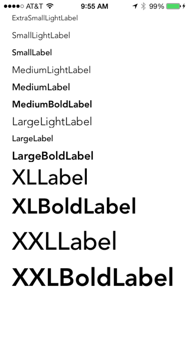

DPTheme
=======

Helps with theming colors and fonts. Sample code included. This code is setracted fro mthe code used in my [Numberpress](https://itunes.apple.com/us/app/numberpress-math-game/id659118210?ls=1&mt=8) app

The code provides 

* a set of labels that have consistent fonts, font sizes and weights. 
* UIColor category that can be used throughout the app to apply a color scheme to an app (background color etc).
* UIFont category to get a set of fonts for the current theme.

It uses UIAppearance proxies and some UILabel subclasses. I need to improve the docs.

All the values are set in plist files which get parsed into DPTheme objects.

There are some similar and more powerful approaches out there that are more like CSS for iOS apps such as [NUI](https://github.com/tombenner/nui), but this is small and easy to use.

Setup
-----

Add a call to DPTThemeManager initializeThemeManagerWithThemeNamed in the application delegate didFinishLaunchingWithOptions or similar place. e.g.

	- (BOOL)application:(UIApplication *)application didFinishLaunchingWithOptions:(NSDictionary *)launchOptions
	{
	    // Override point for customization after application launch.
	    [DPTThemeManager initializeThemeManagerWithThemeNamed:@"Theme1"];// initializes theme manager
	    return YES;
	}

This will load the theme defined in the Theme1.plist file (from the app's main bundle) and setup the appearance proxy objects to use the fonts and sizes defined in the theme file for the various labels.

Use 

	- (DPTTheme *)getThemeNamed:(NSString *)themeName
	
and
	
	- (void)setCurrentTheme:(DPTTheme *)theme
	
to change the theme at any time. The kDPTThemeManagerSchemeChangedNotification will be posted when the theme changes. Your view controllers can listen for this and update dynamically.

Labels
------
The following UILabel subclasses are defined:-

	DPTExtraSmallLightLabel
	DPTExtraSmallLabel
	DPTExtraSmallBoldLabel
	DPTSmallLightLabel
	DPTSmallLabel
	DPTSmallBoldLabel
	DPTMediumLightLabel
	DPTMediumLabel
	DPTMediumBoldLabel
	DPTLargeLabel
	DPTLargeLightLabel
	DPTLargeBoldLabel
	DPTXLLabel
	DPTXLLightLabel
	DPTXLBoldLabel
	DPTXXLLabel
	DPTXXLLightLabel
	DPTXXLBoldLabel
	DPTTitleLabel

Set the Custom Class field in Interface Builder and size the label appropriately based upon your knowledge of the font and size that you have in your theme.plist file. The sample app includes an example showing various themed UILabels.

A limitation is that the UILabel subclasses must be used in Interface Builder only. Using them programmatically doesn't work at the moment.

Colors
---
In your code use the following UIColor category methods to color your views:- 

	@interface UIColor (ColorScheme)
	
	+ (UIColor *)dptBackgroundColor;
	+ (UIColor *)dptForegroundColor;
	+ (UIColor *)dptStrongTextColor;
	+ (UIColor *)dptMediumTextColor;
	+ (UIColor *)dptWeakTextColor;
	
	@end

Generally, you should theme(color) the views during the viewWillAppear method of your controller or when a custom view gets loaded.

Theme File
---
The source of the themes are your theme plist files. They are fairly self-explanatory, but here is a sample of a file to give a brief look at it - 

	<key>TitleFontSize</key>
	<integer>20</integer>
	<key>ExtraExtraLargeFontSize</key>
	<integer>42</integer>
	<key>ExtraLargeFontSize</key>
	<integer>36</integer>
	<key>LargeFontSize</key>
	<integer>19</integer>
	<key>MediumFontSize</key>
	<integer>16</integer>
	<key>SmallFontSize</key>
	<integer>14</integer>
	<key>ExtraSmallFontSize</key>
	<integer>12</integer>
	<key>BoldFontName</key>
	<string>Avenir-Heavy</string>
	<key>RegularFontName</key>
	<string>Avenir-Medium</string>
	<key>LightFontName</key>
	<string>Avenir-Light</string>
	<key>ColorSchemeStrongTextColor</key>
	<dict>
		<key>red</key>
		<integer>20</integer>
		<key>green</key>
		<integer>20</integer>
		<key>blue</key>
		<integer>20</integer>
		<key>alpha</key>
		<integer>1</integer>
	</dict>
Basically, in the file we are defining the font names, the font sizes and the various theme RGB-Alpha colors for the theme in a simple manner.
